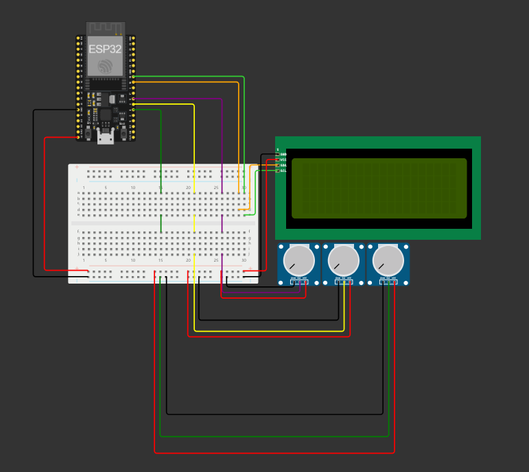

# AlgaXPlore ESP32: Monitoramento de Energia(kWh), CO₂ e pH com Envio via MQTT

## Descrição
O projeto **AlgaXPlore** utiliza um **ESP32** para monitorar dados simulados relacionados à sustentabilidade, como energia gerada (kWh), conteúdo de dióxido de carbono (CO₂) eliminado e nível de pH da água. Os dados são coletados por potenciômetros, exibidos em um **LCD I2C** e enviados para um **broker MQTT**, permitindo o acesso remoto a partir de qualquer lugar.

A proposta do **AlgaXPlore** é simular um sistema que facilita o monitoramento ambiental e energético, apresentando dados importantes de forma acessível e integrando a conectividade IoT para envio e análise remota das informações.

## Funcionalidades
- **Leitura de Sensores:** Leitura de valores simulados de energia (kWh), CO₂ (mg/L) e pH.
- **Exibição de Dados:** Dados são exibidos em tempo real em um display LCD.
- **Conexão Wi-Fi:** O ESP32 conecta-se a uma rede Wi-Fi para comunicação.
- **Publicação MQTT:** Os dados são enviados para um broker MQTT no formato JSON.


## Componentes Utilizados
- 1x ESP32
- 3x Potenciômetros
- 1x Display LCD I2C (20x4)
- 1x Protoboard
- Fios de conexão


## Esquema de Conexão
Veja abaixo o esquema de conexão:



### Detalhes de Conexão
1. **LCD I2C:**
   - SDA: Pino 18 do ESP32
   - SCL: Pino 19 do ESP32
   - VCC e GND: Protoboard

2. **Potenciômetros:**
   - Potenciômetro 1 (Energia): Pino 16 do ESP32
   - Potenciômetro 2 (CO₂): Pino 4 do ESP32
   - Potenciômetro 3 (pH): Pino 0 do ESP32

3. **Alimentação:**
   - VCC e GND conectados à protoboard a partir do ESP32.


## Pré-Requisitos
- **Software:**
  - [Arduino IDE](https://www.arduino.cc/en/software)
  - Bibliotecas Arduino necessárias:
    - `LiquidCrystal_I2C`
    - `WiFi`
    - `PubSubClient`

- **Broker MQTT:**
  - Endereço usado: `test.mosquitto.org`
  - Porta: `1883`


## Configuração do Projeto
### Passos:
1. **Instale as Bibliotecas:**
   - No Arduino IDE, vá para **Sketch > Incluir Biblioteca > Gerenciar Bibliotecas**, procure por:
     - `LiquidCrystal_I2C`
     - `PubSubClient`
   - Instale as bibliotecas necessárias.

2. **Configure o Código:**
   - Substitua o `ssid` e `password` com as credenciais da sua rede Wi-Fi, se aplicável.
   - Ajuste o endereço e porta MQTT caso use outro broker.

3. **Envie para o ESP32:**
   - Conecte o ESP32 ao computador, selecione a porta correta e envie o código.

4. **Monte o Circuito:**
   - Siga o esquema de conexão fornecido.


## Uso
1. Alimente o ESP32.
2. Após a conexão com o Wi-Fi e broker MQTT:
   - Veja os dados exibidos no display LCD.
   - Monitore os dados publicados no tópico MQTT: `alga/plore/test`.

### Formato da Publicação MQTT
Os dados são enviados no formato JSON:
```json
{
  "energy": 75.00,
  "co2": 25.30,
  "ph": 7.50
}
```

## Link para o Wokwi

https://wokwi.com/projects/414536783852875777

## Nomes e RMs

 - Nome: Gustavo Oliveira de Moura RM: 555827
 - Nome: Lynn Bueno Rosa RM: 551102
